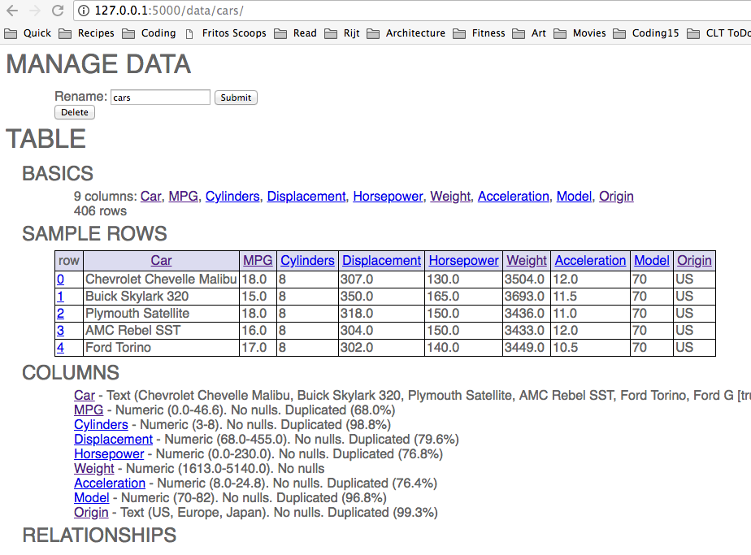
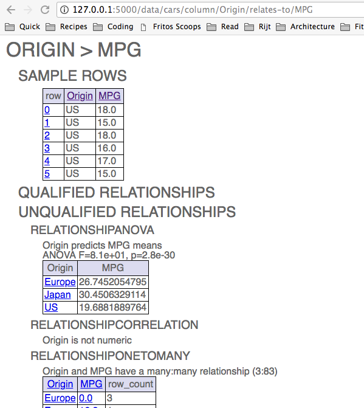

# dfx

_Python package to explore data tables_

Runs as a local web app, presenting automatically generated pages of summaries:



Includes descriptions of how columns relate to each other, such as ANOVAs:




## Install

`pip install git+https://github.com/mclaffey/dfx.git`

## Run

1 . Start the web server from a directory of interest:

```
$ /mydata > dfx
```

2 . Use the file navigator to load a .csv data set.

3 . Use the hyperlinks or shortcut menu to navigate to pages for columns, rows, and inter-column relationships (e.g. ANOVA).
